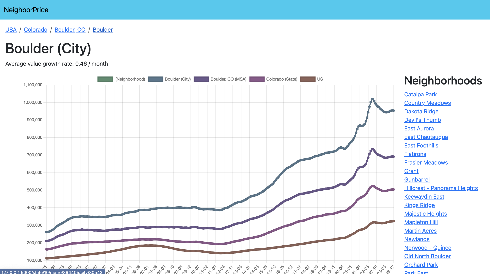

# NeighborPrice

NeighborPrice is an application which lets users view historical prices of 3-bedroom homes in U.S. neighborhoods, with comparisons to their city, MSA (Metro Statistical Area), state, and the U.S. overall.

## Architecture Overview

The software architecture supporting NeighborPrice is made up of 3 components:

- Data Collector
  - The data collector is a Python program which downloads [historical ZHVI (Zillow Home Value Index) datasets](https://www.zillow.com/research/data/) as CSVs from Zillow's public API.
  - After downloading each CSV, it publishes each row of the CSV (representing a single neighborhood, city, MSA, state, or the U.S. overall) to a message queue for processing.
- Data Analyzer
  - The data analyzer is a Python program which consumes a message published by the data collector, transforms them into a format to be easily consumed by the user-facing application, and saves the transformed data into a database.
- NeighborPrice
  - NeighborPrice is a user facing web application built with the Flask Python library.
  - Based on the page visited by the user, the application server retrieves the relevant data documents from the database, and uses them to render the page. 

## Setup & Run

This project includes a `Makefile` which allows easy setup, automated testing, and execution of the various programs. To set up, test, and run the application, run the following commands in the order provided:

1. `make init`
- creates a virtual environment via `venv` and installs dependencies in a `venv` directory within the project
- activates the new virtual environment
- creates a `.docker-data` directory within the project directory where data from the docker containers will live.
- creates a `.env` file of the necessary environment variables by copying the provided `.env.sample` file. These environment variables and their default values are sufficient to run the project locally.
2. `make containers.start`
- pulls Docker containers and starts them via `docker compose`. **You will need `docker compose` installed to run this step**
  - starts a local MongoDB database
  - starts RabbitMQ, a messque broker used to facilitate a message queue for local development
  - starts Prometheus, used to collect application metrics
  - starts Grafana, used to visualize Prometheus metrics data as graphs in a dashboard
 
3. `make test.unit` *(optional)*
- runs all unit tests
4. `make test.integration` *(optional)*
- runs all integration tests
  - the integration tests: 
    - start the MongoDB Docker container 
    - seed data in a test database
    - make requests to the user-facing web server, and make assertions about the HTML in the responses. 
5. `make dev.analyze`
- Starts development version of the `data_analyzer` program, which will consume and process raw data published to the RabbitMQ message queue by the `data_collector` program
- You can start as many instances of the `data_analyzer` as you want and RabbitMQ will handle distributing the messages evenly among them. To start an instance, open a new shell window/tab and run `make_analyze`.
- The `data_analzer` will run until you manually terminate it.
6. `make dev.collect`
- Runs development version of the `data_collector` program, which collects data from Zillow and publishes it to a RabbitMQ message queue, from where it will be consumed by the `data_analyzer`
- You will need at least one instance of the `data_analyzer` running in order for messages published by the `data_collector` to be processed.
- The `data_collector` program will take a few minutes to finish publishing, and the `data_analyzer` program will likely take much longer to process all the messages, however as soon as the messages have started processing, you can run the user-facing web app, and the regions will populate in the app as they are processed.
7. `make dev.run`
- starts the development version of the user-facing web application. When you run this command, you will see the local URL that you can access the app at. 

5. `make containers.stop`
- Stops running the Docker containers.
- Don't run this until you are done using the application.

## Local Development Monitoring

This project includes a system than can be used to monitor the development evironment. See below for a brief decription.

### Application Metrics

The NeighborPrice web application uses the `prometheus_client` library to expose application metrics.

When the application is running, visit [http://127.0.0.1:8000/](http://127.0.0.1:8000/) to view the metrics being exposed.

### Grafana Dashboard

Grafana is included for local development as a Docker container.

## Deployment

This project is configured to deployed in the following way:

#### User facing web application
Configured for deployment to Heroku. 

The included `Profile` tells Heroku how to start the app in a production environment

#### Data Collector & Data Analyzer
Configured for deployment to AWS Lambda. 

While these programs support RabbitMQ as a message broker for local development, they support AWS SNS as a production message broker. 

The `/lambdas` directory contains a subdirectory for each program. Each of these subdirectories contains:
- `lambda_function.py`
  - The entry point that will be executed by AWS Lambda. The lambda function imports the necessary modules and starts the program with AWS SNS as the message broker.
- `requirements.txt`
  - List of dependencies for the lambda function

The `Makefile` includes commands to deploy each of these lambdas to AWS Lambda:

- `deploy.collector`
- `deploy.analyzer`

Running these make commands will:
- package the code needed for the lambda function (including dependencies)
- Publish the package to AWS Lambda

In order to publish using these commands, you will first need to:
- Create the lambda function in AWS Lambda
- Add the ARN in `.env` for the appropriate environment variable, e.g. `$LAMBDA_ARN_DATA_COLLECTOR`