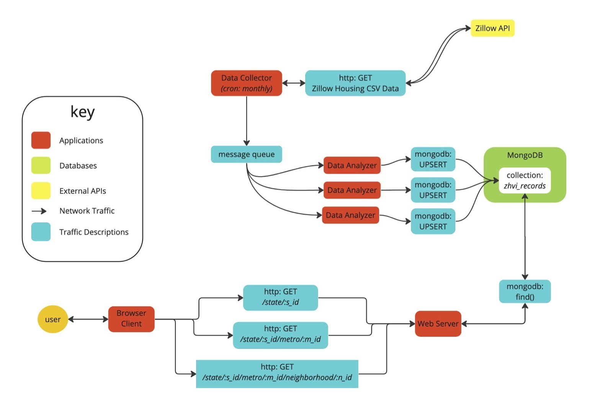

# NeighborPrice

NeighborPrice is an application which lets users view historical prices of 3-bedroom homes in U.S. neighborhoods, with comparisons to their city, MSA (Metro Statistical Area), state, and the U.S. overall.

## Architecture Overview

The software architecture supporting NeighborPrice is made up of 3 components:

- Data Collector
  - The data collector is a Python program which downloads [historical ZHVI (Zillow Home Value Index) datasets](https://www.zillow.com/research/data/) as CSVs from Zillow's public API.
  - After downloading each CSV, it publishes each row of the CSV (representing a single neighborhood, city, MSA, state, or the U.S. overall) to a message queue for processing.
- Data Analyzer
  - The data analyzer is a Python program which consumes a message published by the data collector, transforms them into a format to be easily consumed by the user-facing application, and saves the transformed data into a database.
- NeighborPrice
  - NeighborPrice is a user facing web application built with the Flask Python framework.
  - Based on the page visited by the user, the application server retrieves the relevant data documents from the database, and uses them to render the page.

## Local Development

### Monitoring

#### Application Metrics

The NeighborPrice web application uses the `prometheus_client` library to expose application metrics.

When the application is running, visit [http://127.0.0.1:8000/](http://127.0.0.1:8000/) to view the metrics being exposed.